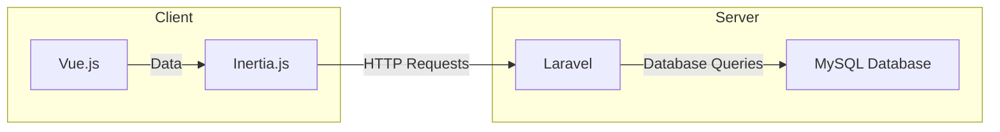

# System Architecture

## Introduction

This document outlines the system architecture for sbfb-stock-control. The application is built using Vue.js, Laravel, Inertia.js, and MySQL.

## System Overview

The system facilitates efficient management of stock in the foodbank warehouse. It allows users to track stock levels, manage incoming and outgoing stock, generate replenishment sheets, and maintain accurate records of stock movements.

## High-Level Architecture

The architecture of the system comprises three main layers:

- **Presentation Layer**: Implemented using Vue.js and Inertia.js, this layer handles the user interface components and provides an intuitive and responsive frontend experience.
  
- **Application Layer**: Built with Laravel, this layer serves as the backend logic of the system, handling business processes, data validation, and interaction with the database.
  
- **Data Layer**: Utilizing MySQL, this layer stores and manages the application's data, including stock information, user profiles, and stock movements.

### Architecture Diagram

  
Click to Expand Diagram

- **Client Side**:
  - Vue.js: A progressive JavaScript framework for building user interfaces.
  - Inertia.js: A library that allows you to create server-driven single page apps, leveraging backend frameworks like Laravel.

- **Server Side**:
  - Laravel: A PHP web application framework for building web applications following the MVC architectural pattern.
  - MySQL Database: A relational database management system used for storing application data.

The flow of data is as follows:
- User interactions and data requests are handled by Vue.js and Inertia.js on the client-side.
- Inertia.js sends HTTP requests to the Laravel backend.
- Laravel processes these requests, executes business logic, and interacts with the MySQL database to fetch or update data.

## Detailed Components

### Presentation Layer (Vue.js + Inertia.js):
- Components: Utilizes Vue components for modular development and reusability.
- State Management: Implements Vuex for centralized state management.
- Routing: Utilizes Vue Router for client-side routing and navigation.
- Inertia.js: Facilitates server-driven single-page apps (SPAs) by providing seamless integration with Laravel backend.

### Application Layer (Laravel):
- RESTful API: Exposes RESTful endpoints to interact with the frontend.
- Authentication: Implements JWT (JSON Web Tokens) for user authentication and authorization.
- Middleware: Utilizes middleware for request handling, validation, and authentication.

### Data Layer (MySQL):
- Database Schema: Defines tables and relationships to store stock and user data.
- Data Access: Utilizes Laravel's Eloquent ORM for database interaction and query management.
- Indexing and Optimization: Implements indexing and optimization techniques to enhance database performance.

## Infrastructure Setup

- Hosting: Hosted on a cloud platform such as AWS (Amazon Web Services) or Google Cloud Platform.
- Server Configuration: Utilizes Linux-based servers (e.g., Ubuntu) with Nginx for web server configuration.
- Database Setup: Utilizes MySQL as the relational database management system.

## Data Architecture

- Database Schema: Defines tables for stock items, users, replenishments etc.
- Relationships: Establishes relationships between tables using foreign keys for data integrity.
- Indexing: Implements indexing on frequently queried columns for improved query performance.

## Security Architecture

- Authentication: Implements JWT-based authentication for secure user access.
- Authorization: Utilizes role-based access control (RBAC) to manage user permissions.
- Data Encryption: Implements encryption techniques for sensitive data storage and transmission.

## Performance and Scalability

- Caching: Utilizes caching mechanisms (e.g., Redis) to optimize data retrieval and improve application performance.
- Horizontal Scaling: Allows horizontal scaling by adding additional server instances to handle increased user loads.

## Integration Points

- Integration with Barcode Scanners and label printers: Integrates with barcode scanners and label printers for efficient stock management and inventory tracking.

## Deployment Strategy

- Continuous Integration/Continuous Deployment (CI/CD): Implements CI/CD pipelines for automated testing, building, and deployment.
- Version Control: Utilizes Git for version control and collaboration.

## Conclusion

The system architecture leverages Vue.js, Inertia.js, Laravel, and MySQL to provide a robust and scalable solution for managing stock in the warehouse. By adhering to best practices in system architecture and design, the system ensures reliability, security, and performance in warehouse operations.

### References
- Vue.js Documentation: [Link](https://vuejs.org/)
- Inertia.js Documentation: [Link](https://inertiajs.com/)
- Laravel Documentation: [Link](https://laravel.com/docs)
- MySQL Documentation: [Link](https://dev.mysql.com/doc/)
